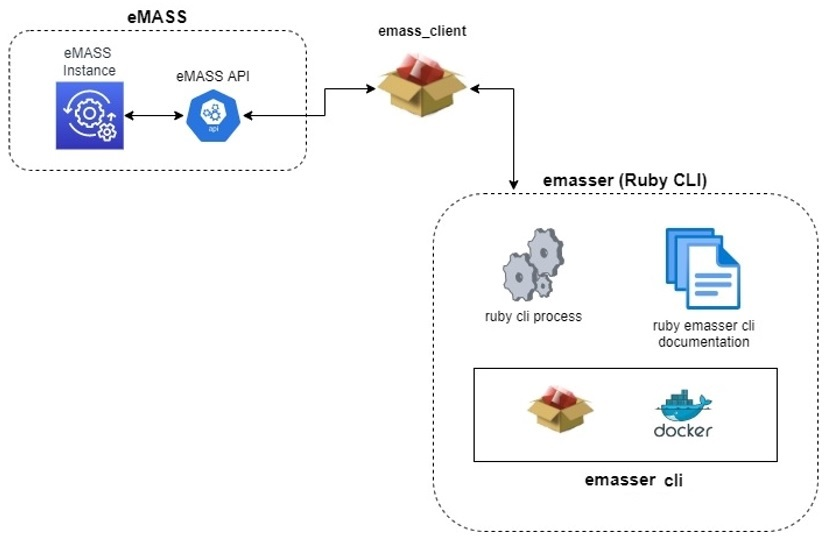

# emasser

  


## About

`emasser` is a Command Line Interface (CLI) that aims to automate routine business use-cases and provide utility surrounding the Enterprise Mission Assurance Support Service (eMASS) by leveraging its Representational State Transfer (REST) Application Programming Interface (API). 

***NOTE***: The `emasser` CLI utilizes the [emass_client](https://github.com/mitre/emass_client) RubyGem executable package to access the eMASS API endpoints.

---
## Documentation
For detail content information about the `eMASS` API references the [**eMASS API Specification**](https://mitre.github.io/emass_client/docs/redoc/) page.

For detail features provided by the `emasser` CLI references the [**emasser CLI Features**](docs/features.md) page.

The `emasser` CLI [**Architecture**](#emasser-cli-architecture) depicts the `emasser` structure, and provides an explanation of how it behaves. 

---
## Installation Options

`emasser` is a Ruby CLI distributed via GitHub (this repository), [RubyGems](https://rubygems.org/gems/emass_client/versions/), or [Docker](https://hub.docker.com/r/mitre/emasser/tags).

### Installation Dependencies
  * git
  * Ruby version 2.7 or greater

### Runtime Dependencies
  * Ruby version 2.7 or greater.
  * `rubyzip (latest version)`
  * `emass_client (latest version)`
  * On Windows the `cURL` binary is required (libcurl.dll). To install cURL:
    - Download cURL for windows from [curl x.x.x for Windows](https://curl.se/windows/)
      - Go into the archive and browse to the /bin directory
      - Locate libcurl_x64.dll (it may be named just libcurl.dll)
      - Extract the file into the Ruby installation /bin directory
      - Rename the file to `libcurl.dll` if it has the `_x64` suffix
    - Install [cURL for windows](https://community.chocolatey.org/packages/curl) and add the installation directory to the PATH.


## Install via GitHub
- [Clone](https://docs.github.com/en/repositories/creating-and-managing-repositories/cloning-a-repository) the repository
  ```bash
  git clone <path to emasser repository> emasser
  cd emasser
  ```
- Build the emasser gem*
  ```bash
    gem build *.gemspec
    gem install *.gem
  ```

***Note:** To run in development mode there isn't a need to build the gem, simply clone from the emasser repository and use:

```
bundle install

bundle exec exe/emasser [command]
```

## Install via published RubyGems
- Install the `emasser` gem from the [RubyGems](https://rubygems.org/gems/emass_client/versions/) registry
    ```bash
    gem install emasser
    ```
- Update the `emasser` gem to the latest version
  ```bash
  gem update emasser
  ```

- To run (execute a command) create a `.env*` file in the directory where you want to invoke the `emmaser` and use: 
  
  ```
  emasser [command]
  ```
***Note:** See [Setting Environment Variables Configuration](https://github.com/mitre/emasser/wiki/Editing-Environment-Variables-Configuration) for detailed information on required and optional variables.

## Using Docker
Ensure that docker engine is running and start the emasser Docker Container.
### Install
- On Linux or Mac:
  ```
  docker run --rm -v $PWD/path-to-secrets:/data mitre/emasser:latest
  ```
- On Windows:
    ```
    docker run --rm -v %cd%/path-to-secrets:/data mitre/emasser:latest
    ```
- Update via Docker
  ```bash
    docker pull mitre/emasser:latest
  ```

**Docker Notes:**
- Docker Options
  - `--rm` Automatically remove the container when it exits
  - `-v` Bind mount a volume
- path-to-secrets
  - Is the path to the `.env` file and the appropriate eMASS certificates (key.pem and client.pem).
  - For example, if the `.env` is located in the same directory where the `docker run` is executed, running the command in a Windows platform would look like this:
  
      ```
      docker run --rm -v %cd%/.:/data mitre/emasser:latest
      ```
  -  See [Editing Environment Variables Configuration](https://github.com/mitre/emasser/wiki/Editing-Environment-Variables-Configuration)

### Run emasser API client commands
- To list all available GET, POST, PUT, or DELETE commands use:
  ```
  docker run --rm -v $PWD/path-to-secrets:/data mitre/emasser:latest get help
  ```
  ```
  docker run --rm -v $PWD/path-to-secrets:/data mitre/emasser:latest post help
  ```
  ```
  docker run --rm -v $PWD/path-to-secrets:/data mitre/emasser:latest put help
  ```
  ```
  docker run --rm -v $PWD/path-to-secrets:/data mitre/emasser:latest delete help
  ```
  Example commands are for Linux or Mac, replace the `$PWD` with `%cd%` for Windows

### Delete (remove) the Docker Container
```
  docker rmi -f mitre/emasser
```
---
## Roadmap

The `emasser` implements all endpoints provided by the `eMASS` API, there is, all of the functions available from the `eMASS GUI` that are exposed by the API. If additional functions are useful (accessible via the CLI), please submit a request to [eMass Tier III Support](mailto:disa.meade.id.mbx.emass-tier-iii-support@mail.mil) for possible inclusion into the API.

The Road Map seeks to add any useful features that facilitates organization that utilizes  `eMASS` instances and have a need to automate their cybersecurity management process. 

For additional capability create an [issue](https://github.com/mitre/emasser/issues), and email it to the [SAF Team](mailto:saf@groups.mitre.org) citing the issue link so we can help.

Some proposed capabilities (looking for a sponsor) are:
* Update a system's record with met/not met NIST 800-53 Security and Privacy controls and/or common control indicators (CCI) based on scan results expressed in [Heimdall Data Format (HDF)](https://saf.mitre.org/#/normalize).
* Resolve a particular plan of action and milestone (POA&M) based on scan results or git-ops workflow.
* PKCS11 support to run in an attended mode.


## Design

### Interactions with eMASS API
The `emasser` CLI leverages the [emass_client](https://github.com/mitre/emass_client), which provides a REST API client developed by MITRE based on the [OpenAPI V3](https://www.openapis.org/) standards for the official [eMASS API specification](https://mitre.github.io/emass_client/docs/redoc). This design enables REST API clients to be generated in [any supported programming language](https://openapi-generator.tech/docs/generators/). The design enables the `emass_client` to be generated independently of the emasser CLI. Currently, a Ruby and a Typescript eMASS client API are provided. The TypeScript client is used with the [Security Automation Framework CLI (SAF) CLI](https://github.com/mitre/saf).

### Business Logic
Because interactions with the API are handled by a dependency, the bulk of `emasser` business logic is for accepting user input/output, reading data from eMASS or from input, transforming data, and routing data to the appropriate eMASS API endpoint. This business logic is organized into Ruby Classes and Modules based on the command or subcommand requested by the user.

## Emasser CLI Architecture
The `emasser` CLI makes use of the `emass_client` ruby gem to communicate with an `eMASS` instance via the `eMASS API` as depicted in the diagram below:

<div align="center">
  
</div>

### NOTICE

© 2020 The MITRE Corporation.

Approved for Public Release; Distribution Unlimited. Case Number 18-3678.

### NOTICE

MITRE hereby grants express written permission to use, reproduce, distribute, modify, and otherwise leverage this software to the extent permitted by the licensed terms provided in the LICENSE.md file included with this project.

### NOTICE

This software was produced for the U. S. Government under Contract Number HHSM-500-2012-00008I, and is subject to Federal Acquisition Regulation Clause 52.227-14, Rights in Data-General.

No other use other than that granted to the U. S. Government, or to those acting on behalf of the U. S. Government under that Clause is authorized without the express written permission of The MITRE Corporation.

For further information, please contact The MITRE Corporation, Contracts Management Office, 7515 Colshire Drive, McLean, VA  22102-7539, (703) 983-6000.
